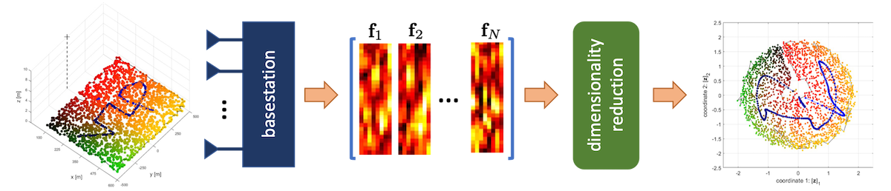
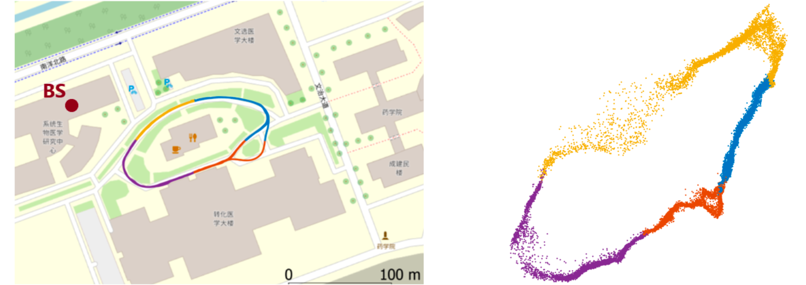

## What is Channel Charting?

**Channel charting** learns a mapping from channel state information (CSI) to a so-called **channel chart** in which nearby datapoints indicate nearness in real space. In other words, the learned channel chart captures the nearby spatial geometry of the transmitting user equipments (UEs), effectively encoding relative (or logical) UE locations. Channel charting is self-supervised as the mapping from CSI to the channel chart is learned only using a database of passively collected CSI information. Such a data-driven localization approach has the advantages of being scalable and avoiding reference location information, e.g., from global navigation satellite systems (GNSSs). The self-supervised nature of channel charting also avoids the need for line-of-sight (LoS) propagation conditions or (costly) measurement campaigns, while enabling the infrastructure basestations or access points to perform cognitive and predictive radio access network (RAN) tasks which are tied to UE location. 

### Typical Channel Charting Pipeline 

An infrastructure basestation (BS) or access point (AP) *passively* collects high-dimensional CSI (describing complex-valued frequency and time coefficients at possibly multiple antennas) from a large number transmitting UEs and/or UE locations. The BS or AP then extracts CSI features, which describe large-scale fading properties contained in the collected CSI. Finally, dimensionality reduction (DR)-techniques are applied to the CSI-feature database in order to learn a low-dimensional description, which is the **channel chart**. The channel chart has the key property that nearby points correspond to nearby locations in real space. 

### Typical Channel Chart from Real-World Measurements

The above figure shows channel charting results obtained from real-world measurements (240,000 CSI samples) acquired with a 32-antenna BS operating at 2.5 GHz. The left part shows the measurement campaign consisting of a loop-shaped path acquired over 20 minutes with four quadrants colored differently. The right part shows the resulting channel chart obtained using a triplet-loss-based neural network. One can see that local geometry is very well preserved in the channel chart. Consequently, tracking user equipments in the channel chart will enable location dependent tasks in a purely self-supervised fashion. *The above figure is courtesy of Ferrand, Decurninge, Ordoñez, and Guillaud, 2021.*  

* * *

## Publications

2018 

* C. Studer, S. Medjkouh, E. Gönültaş, T. Goldstein, and O. Tirkkonen, "<a href="https://ieeexplore.ieee.org/abstract/document/8444621">Channel Charting: Locating Users Within  the Radio Environment Using Channel State Information</a>," IEEE Access, Vol. 6, pp. 47682-47698, Aug. 2018

* J. Deng, S. Medjkouh, N. Malm, O. Tirkkonen, and C. Studer, "<a href="https://www.research-collection.ethz.ch/handle/20.500.11850/461322">Multipoint Channel Charting for Wireless Networks</a>," 52nd Asilomar Conference on Signals, Systems, and Computers, Oct. 2018

2019 

* T. Ponnada, J. Al-Tous, O. Tirkkonen, and C. Studer, "<a href="https://www.research-collection.ethz.ch/handle/20.500.11850/461386">An Out-of-Sample Extension for Wireless Multipoint Channel Charting</a>," Intl. Conference on Cognitive Radio Oriented Wireless Networks, June 2019

* P. Huang, O. Castañeda, E. Gönültaş, S. Medjkouh, O. Tirkkonen, T. Goldstein, and C. Studer, "<a href="https://arxiv.org/abs/1908.02878">Improving Channel Charting with Representation-Constrained Autoencoders</a>," IEEE 20th Intl. Workshop on Signal Processing Advances in Wireless Communications (SPAWC), July 2019

* E. Lei, O. Castañeda, O. Tirkkonen, T. Goldstein, and C. Studer, "<a href="https://arxiv.org/abs/1909.13355">Siamese Neural Networks for Wireless Positioning and Channel Charting</a>," 57th Annual Allerton Conference on Communication, Control, and Computing (Allerton), Sep. 2019

2020

* C. Geng, J. Huang, and J. Langerman, "Multipoint Channel Charting with Multiple-Input Multiple-Output Convolutional Autoencoder," IEEE/ION Position, Location and Navigation Symposium (PLANS), Apr. 2020, <a href="https://ieeexplore.ieee.org/document/9109875">paywall link</a>

* P. Agostini, Z. Utkovski, and S. Stańczak, "Channel Charting: An Euclidean Distance Matrix Completion Perspective," IEEE Intl. Conference on Acoustics, Speech and Signal Processing (ICASSP), May 2020, <a href="https://ieeexplore.ieee.org/abstract/document/9053639">paywall link</a>

* P. Kazemi, H. Al-Tous, C. Studer, and O. Tirkkonen, "<a href="https://acris.aalto.fi/ws/portalfiles/portal/61183483/SNR_Prediction_in_Cellular_Systems_based_on_Channel_Charting.pdf">SNR Prediction in Cellular Systems based on Channel Charting</a>," IEEE Eighth Intl. Conference on Communications and Networking (ComNet), Oct. 2020

* P. G. Burguera, "<a href="https://aaltodoc.aalto.fi/bitstream/handle/123456789/97603/master_Garau_Burguera_Pere_2020.pdf?sequence=1">Logical Radio Maps for User Localization in a Real Outdoor Radio Environment</a>," M.S. Thesis report, Aalto University, Finland, Nov. 2020

* J. Pihlajasalo, M. Koivisto, J. Talvitie, S. Ali-Löytty, M. Valkama, "Absolute Positioning with Unsupervised Multipoint Channel Charting for 5G Networks," IEEE 92nd Vehicular Technology Conference (VTC2020-Fall), Nov. 2020, <a href="https://ieeexplore.ieee.org/document/9348571">paywall link</a>

* H. Al-Tous, T. Ponnada, C. Studer, and O. Tirkkonen, "<a href="https://www.research-collection.ethz.ch/handle/20.500.11850/452594">Multipoint Channel Charting-Based Radio Resource Management for V2V Communications</a>," EURASIP Journal on Wireless Communications and Networking, Dec. 2020

* P. Ferrand, A. Decurninge, L. G. Ordoñez, and M. Guillaud, "<a href="https://arxiv.org/abs/2005.12242">Triplet-Based Wireless Channel Charting</a>," IEEE Global Communications Conference (GLOBECOM), Dec. 2020

* L. Ribeiro, M. Leinonen, D. Djelouat, and M. Juntti, "Channel Charting for Pilot Reuse in mMTC with Spatially Correlated MIMO Channels,"  IEEE Globecom Workshops, Dec. 2020, <a href="https://ieeexplore.ieee.org/abstract/document/9367434">paywall link</a>

2021

* H. Al-Tous, O. Tirkkonen, and J. Liang, "Adaptive Sector Splitting based on Channel Charting in Massive MIMO Cellular Systems," 2021 IEEE 93rd Vehicular Technology Conference (VTC2021-Spring), Apr. 2021, <a href="https://ieeexplore.ieee.org/document/9448830">paywall link</a>

* T. Ponnada, H. Al-Tous, O. Tirkkonen, "Location-Free Beam Prediction in mmWave Systems," IEEE 93rd Vehicular Technology Conference (VTC2021-Spring), Apr. 2021, <a href="https://ieeexplore.ieee.org/document/9448938">paywall link</a>

* P. Kazemi, T. Ponnada, H. Al-Tous, Y.-C. Liang, and O. Tirkkonen, "Channel Charting Based Beam SNR Prediction," Joint European Conference on Networks and Communications & 6G Summit (EuCNC/6G Summit), June 2021, <a href="https://ieeexplore.ieee.org/abstract/document/9482548">paywall link</a>

* T. Ponnada, P. Kazemi; H. Al-Tous; Y.-C. Liang, and O. Tirkkonen, "Best Beam Prediction in Non-Standalone mm Wave Systems," Joint European Conference on Networks and Communications & 6G Summit (EuCNC/6G Summit), June 2021, <a href="https://ieeexplore.ieee.org/abstract/document/9482504">paywall link</a>

* J. Deng, O. Tirkkonen; J. Zhang; X. Jiao, and C. Studer, "Network-side Localization via Semi-Supervised Multi-point Channel Charting,"  International Wireless Communications and Mobile Computing (IWCMC), June 2021, <a href="https://ieeexplore.ieee.org/abstract/document/9498723">paywall link</a>

* Q. Zhang and W. Saad, "<a href="https://arxiv.org/abs/2108.08241">Semi-Supervised Learning for Channel Charting-Aided IoT Localization in Millimeter Wave Networks</a>," accepted to IEEE GLOBECOM 2021, arXiv preprint: 2108.08241, Aug. 2021

* P. Ferrand, A. Decurninge, L. G. Ordoñez, and M. Guillaud, "<a href="https://doi.org/10.1109/JSAC.2021.3087251">Triplet-Based Wireless Channel Charting: Architecture and Experiments</a>," IEEE Journal on Selected Areas in Communications, Aug. 2021

* L. Le Magoarou, "<a href="https://arxiv.org/abs/2104.13184v2">Efficient Channel Charting via Phase-Insensitive Distance Computation</a>," IEEE Wireless Communications Letters, Sep. 2021

* B. Rappaport, E. Gönültaş, J. Hoydis, M. Arnold, P. K. Srinath, and C. Studer, "<a href="https://arxiv.org/abs/2110.11279">Improving Channel Charting using a Split Triplet Loss and an Inertial Regularizer</a>," IEEE 17th International Symposium on Wireless Communication Systems (ISWCS), Sept. 2021

2022

* L. Ribeiro, M. Leinonen, H. Al-Tous, O. Tirkkonen, and M. Juntti, "<a href="https://arxiv.org/abs/2203.06651">Pilot Reuse for mMTC with Spatially Correlated MIMO Channels: A Channel Charting Approach</a>," arXiv preprint, Mar. 2022 

* A. Patrick, Z. Utkovski, S. Stańczak, A. A. Memon, B. Zafar, and M. Haardt., "Not-Too-Deep Channel Charting (N2D-CC)," IEEE Wireless Communications and Networking Conference (WCNC), Apr. 2022, <a href="https://ieeexplore.ieee.org/abstract/document/9771913">paywall link</a>

* P. Q. Viet and D. Romero, "<a href="https://arxiv.org/pdf/2204.10690.pdf">Implicit Channel Charting with Application to UAV-aided Localization</a>," IEEE International Workshop on Signal Processing Advances in Wireless Communications (SPAWC), July 2022 

* F. Euchner, P. Stephan, M. Gauger, S. Dörner, S. ten Brink, "<a href="https://arxiv.org/abs/2206.09774">Improving Triplet-Based Channel Charting on Distributed Massive MIMO Measurements</a>," IEEE International Workshop on Signal Processing Advances in Wireless Communications (SPAWC), July 2022
 
## Tutorials

* M. Guillaud and C. Studer, "<a href="https://github.com/channelcharting/channelcharting.github.io/blob/main/pdf/channel_charting_tutorial.pdf">Wireless Channel Charting for Massive MIMO</a>," IEEE Wireless Communications and Networking Conference (WCNC), Apr. 2022
* P. Stefan, "<a href="https://dichasus.inue.uni-stuttgart.de/tutorials/tutorial/channelcharting/">Channel Charting - Mapping the Radio Environment</a>," Online Tutorial including a Jupyter Notebook, Jul. 2022, <a href="https://dichasus.inue.uni-stuttgart.de/datasets/">link to datasets</a>

## Software

* <a href="https://github.com/IIP-Group/ChannelCharting">Simple Channel Charting MATLAB Simulator

## Patents

* C. Studer and O. Tirkkonen, "<a href="https://patents.google.com/patent/US10911168B2/en">Channel Charting in Wireless Systems</a>," U.S. Patent No. 10911168, Feb. 2021

* * *

## Contact

This website is maintained by the <a href="https://iip.ethz.ch/">Integrated Information Processing (IIP) Group</a>, led by <a href="mailto:studer@ethz.ch?subject=Channel Charting Repository">Prof. Christoph Studer</a>, in the <a href="https://ee.ethz.ch/">Department of Information Technology and Electrical Engineering</a> at <a href="https://ethz.ch/en.html">ETH Zürich</a>, Switzerland. 

### Suggest a Resource

In case you would like to suggest a publication, patent, dataset, or software link, then please contact  <a href="mailto:studer@ethz.ch?subject=New Channel Charting Resource">Christoph Studer</a> and provide all the necessary details required to create an item in the above lists. Please note that we prefer open-access resources and discourage the use of papers behind a paywall. 

Website last updated by CS on May 29, 2022. 
